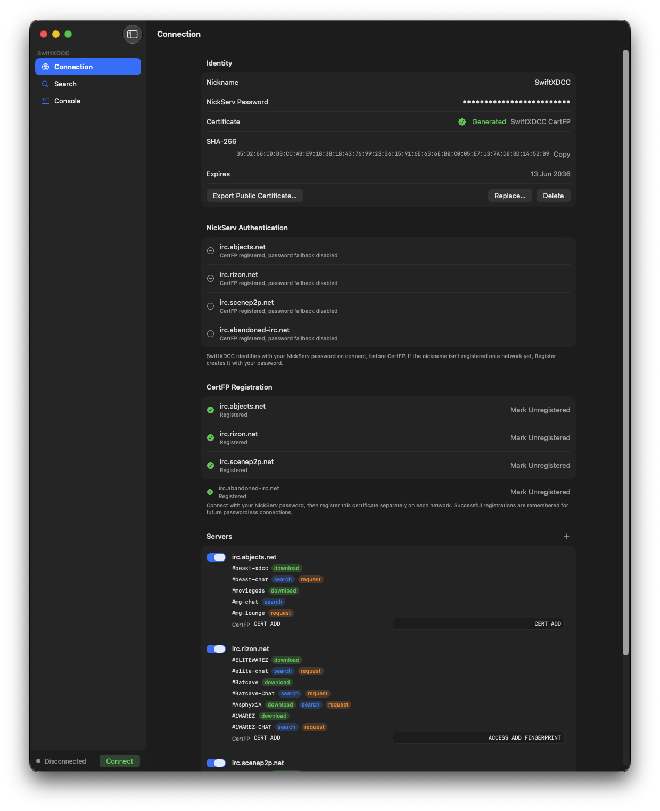
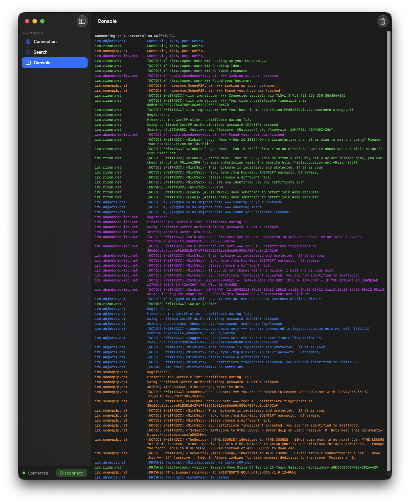
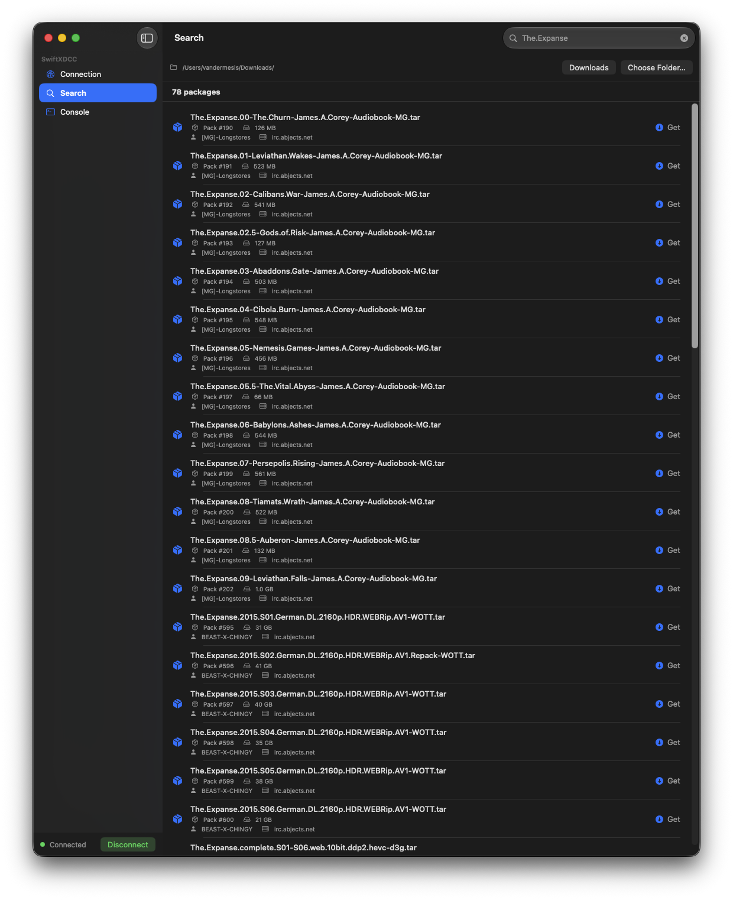

# SwiftXDCC
### Swift XDCC search and download client for macOS
---
Simple and customizable application for search and download xdcc packages from most popular irc networks.
All applilcation is written in Swift language using these great and important libraries:
- [swift-atomics 1.3.0](https://github.com/apple/swift-atomics.git)
- [swift-collections 1.6.0](https://github.com/apple/swift-collections.git)
- [swift-nio 2.101.0](https://github.com/apple/swift-nio.git)
- [swift-nio-irc 0.8.2](https://github.com/SwiftNIOExtras/swift-nio-irc.git)
- [swift-nio-irc-client 0.8.1](https://github.com/NozeIO/swift-nio-irc-client.git)
- [swift-nio-ssl](https://github.com/apple/swift-nio-ssl)
- [swift-nio-transport-services](https://github.com/apple/swift-nio-transport-services.git)
- [swift-system](https://github.com/apple/swift-system)

Work in progress
---

---
